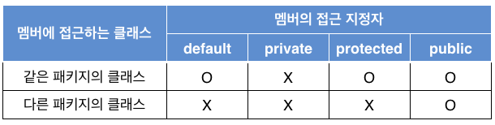

## Overview

Java는 **객체 지향 언어**(Object Oriented Language)로써, 기존 **절차 지향 언어**(Structured Procedural Programming Language)의 단점을 보완하고 다음의 목적을 달성하기 위해 탄생했다.

***

### 객체 지향 언어의 목적

#### 1. 소프트웨어의 생산성 향상

객체 지향 언어가 나온 배경은 컴퓨터 산업이 발전함에 따라 소프트웨어의 생명 주기(Life cycle)가 짧아졌는데, 이는 어떤 제품이 기획되면 짧은 시간안에 소프트웨어를 만들어야 했기 때문이다.

객체 지향 언어는 **상속**, **다형성**, **객체**, **캡슐화** 등 소프트웨어의 재사용을 위한 여러 장치를 가지고 있어, 기존의 것을 재사용하거나 부분 수정을 통해 소프트웨어를 만드는데 드는 부담을 대폭 줄일 수 있다.

이는 곧 소프트웨어의 생산성을 향상시킬 수 있게 된다.

#### 2. 실세계에 대한 쉬운 모델링

과거 절차 지향 언어를 사용한 소프트웨어는 수학 계산이나 통계처리를 하는 등 대체로 처리 과정이나 계산의 절차가 중요했다.

요즘은 컴퓨터가 산업 전반에 활용됨에 따라 실세계의 일을 프로그래밍해야 할 일이 많아져 절차로만 묘사하는 것이 쉽지 않아졌다.

실세계의 일은 절차나 과정보다는 일과 관련된 많은 물체(객체)들의 상호작용으로 묘사하는 것이 사람이 이해하기 쉽고 이를 프로그래밍하기 위해 객체를 중심으로 하는 객체 지향 언어가 나타나게 되었다.

***

### 객체 지향 언어의 특성

프로그래밍 언어에서 객체가 다음과 같은 특성을 가질 때 객체 지향적이라고 한다.

#### 1. 캡슐화(Encapsulation)

캡슐화란 객체를 캡슐로 싸서 그 내부를 보호하고 볼 수 없게하는 것을 말한다.

자바에서의 객체는 **메소드**(함수)와 **필드**(데이터 변수)로 구성된다.

**클래스**(class)라는 캡슐을 사용하여 객체를 표현하며 메소드(method)와 필드(field)를 클래스 내에 구현한다.

이렇게 함으로써 객체 외부에서는 객체 내의 숨겨놓은 메소드나 필드를 직접 접근할 수 없으며 메소드의 구현 내용도 알 수 없다.

이를 캡슐화라고 하며 궁극적인 목적은 객체 내 데이터에 대한 **보안**, **보호**, **외부 접근 제한**등을 위한 것이다.

외부에서 클래스 내부의 데이터 접근을 금지하는 것을 **정보 은닉**(information hiding)이라 한다.


#### 2. 상속(Ingeritance)

**상속**은 상위 개체의 속성이 하위 개체에 물려져, 하위 개체가 상위 개체의 속성을 모두 가지고 있음을 의미하는 관계이다.

자바에서 상속은 **부모 클래스**의 속성을 **자식 클래스**가 물려받는 개념이다.

자바에서 부모 클래스를 **슈퍼 클래스**(super class)라고 부르며 이를 상속받는 클래스를 **서브 클래스**(sub class)라고 부른다.

상속은 이미 만들어진 클래스의 필드와 메소드를 물려받게 함으로써 자바 코드의 **중복 작성을 방지**하여 코드 작성에 드는 시간과 비용을 줄일 수 있게 한다.

즉 상속은 **코드의 재사용**을 가능하게 한다.

#### 3. 다형성(Polymorphism)

**다형성**은 같은 이름의 함수 호출에 대해 객체에 따라 다른 동작을 할 수 있도록 구현되는 것을 의미한다.

다형성은 **오버로딩**, **오버라이딩**과 밀접한 관계가 있다.

***

## 클래스와 객체

**객체 지향 프로그래밍**에서 실제 세상의 물체들을 객체로 모델링을 한다.

실제 세상에서는 많은 사람들이 있지만 사람을 사람으로 구별지을 수 있는 공통된 특징을 가지고 있다.

이 공통된 특징, 속성을 기술한 것이 **클래스**이다.

그리고 사람은 그 속성에 따라 만들어진 **인스턴스**(Instance), **객체**(Object)라고 할 수 있다.

즉, 클래스는 객체를 생성하기 위한 설계도, 틀이라고 할 수 있고 객체는 클래스로 만들어낸 실체라고 볼 수 있다.

### Class 구성

자바에서 클래스를 선언할 때 `class` 키워드를 사용한다.

다음은 자바에서 클래스를 선언하는 예이다.

```java
/**
* code_01
*/
public class Person {
    public String name;         // 필드(field)
    public int age;

    public Person() {           // 생성자(Constructor)
    }
    
    public Person(String s) {   // 생성자(Constructor)
        name = s;       
    }

    public String getName() {   // 메소드(method)
        return name;    
    }
}
```

- 클래스 접근 권한, `public`  
    - 접근 권한을 표시하는것으로, `public` 접근 권한은 다른 모든 클래스들이 이 클래스에 대해 사용, 접근이 가능함을 뜻한다.
- class Person
    - `Person`이라는 이름의 클래스를 정의한다. `class` 다음에 클래스의 이름을 정의한다.
    - 클래스는 '{'으로 시작하고 '}'으로 닫으며 이곳에 모든 멤버 필드와 메소드를 구현한다.
- 필드(field)
    - 값을 저장할 멤버 변수를 선언한다. **멤버 변수** 혹은 **필드**라고 부른다.
    - 필드 앞에 붙은 접근 지정자 `public`은 이 필드가 다른 클래스에서 접근될 수 있도록 공개한다는 뜻이다.
- 생성자(Constructor)
    - 클래스의 이름과 동일한 메소드를 **생성자**(constructor)라고 한다.
    - 생성자는 이 클래스의 객체가 생성될 때만 호출되는 메소드이다.
- 메소드(method)
    - 메소드는 실행 가능한 함수이며 객체의 행위를 구현한다.
    - 메소드 앞에 붙은 접근 지정자 `public`은 이 메소드가 다른 클래스에서 접근될 수 있도록 공개한다는 뜻이다.

### 객체 생성과 레퍼런스 변수

위 `code_01`에서 정의한 클래스의 객체 혹은 인스턴스를 생성해보자.

`Person` 클래스의 객체를 생성하고 활용하는 예는 다음과 같다.

```java
/**
* code_02
*/
public static void main(String args[]) {
    Person aPerson;                 // 객체에 대한 레퍼런스 변수 aPerson 선언
    aPerson = new Person("김길동"); // Person 객체 생성

    aPerson.age = 30;
    String s = aPerson.getName();
}
```

- `Peson` 클래스의 레퍼런스 변수 `aPerson` 선언
    - 객체를 생성하기 전 객체를 가리킬 레퍼런스 변수의 선언이 필요하다.
        ```java
        Person aPerson;  // 레퍼런스 변수 aPerson 선언
        ```
    - 이 선언문으로는 `Person` 객체가 생성되지 않는다. 변수 `aPerson은` `Person` 타입의 객체에 대한 레퍼런스를 가지는 변수의 선언일 뿐 객체 자체는 아니다.
    - 따라서 아직 객체가 생성된 것이 아니며 어떤 객체도 가리키고 있지 않은 상태이다.
- 객체 생성, `new` 연산자 이용
    - 자바에서는 반드시 `new` 연산자를 사용하여 다음과 같이 객체를 생성해야 한다.
        ```java
        aPerson = new Person("김길동");
        ```
    - 이 문장은 생성된 `Person` 객체에 대한 레퍼런스 값을 `aPerson` 변수에 대입한다.
    - `new` 연산자에 의해 객체가 생성되는 과정은 다음과 같다.
        > 1. `Person` 타입의 객체 메모리 공간확보  
        > 2. `Person(String s) {...}` 생성자가 생성되어 `name` 필드 값을 `"김길동"`으로 설정

### 객체 멤버 접근

객체의 멤버에 접근할 때는 다음과 같이 점(.) 연산자를 붙인다.

> 객체 레퍼런스.멤버

예를 들어, 다음 코드는 aPerson 객체의 age 필드에 30을 대입한다.

```java
aPerson.age = 30;
```

반대로 aPerson 객체의 age 필드의 값을 읽어내고자 하면 다음과 같이 할 수 있다.

```java
int i = aPerson.age;
```

다음 코드는 aPerson 객체의 getName() 메소드를 호출한다.

```java
String s = aPerson.getName();
```

#### *Ex. 지수 클래스 MyExp*

```java
/**
* code_03
*/
public class MyExp {
    int base;
    int exp;
    int getValue() {
        int res=1;
        for (int i = 0; i < exp; i++) {
            res = res * base;
        }
        return res;
    }

    public static void main(String[] args) {
        MyExp num1 = new MyExp();
        num1.base = 2;
        num1.exp = 3;
        MyExp num2 = new MyExp();
        num2.base = 3;
        num2.exp = 4;

        System.out.println("2의 3승 =" + num1.getValue());
        System.out.println("3의 4승 =" + num2.getValue());
    }
}
```

> `MyExp`는 지수 값을 표현하는 클래스로서 두 개의 정수형 멤버 필드 `base`와 `exp`를 가진다.  
> $$2^3$$의 경우, `base`는 2이며, `exp`는 3이다. 또한 `MyExp`는 정수 값을 리턴하는 `getValue()`라는 메소드를 제공한다.  
> `getValue()`는 `base`와 `exp`값으로부터 지수를 계산하여 정수 값으로 리턴한다.  
> 예를 들어, `base`가 2, `exp`가 3이라면 `getValue()`는 8을 리턴한다.  

### 객체 배열

자바 기본타입의 배열과 같이 객체가 원소인 객체 배열도 만들 수 있다.

객체 배열이란 객체에 대한 레퍼런스를 원소로 갖는 배열이다.

다음 코드를 이용하여 객체 배열을 설명한다.

```java
/**
* code_04
*/
Person[] pa;                // 배열에 대한 레퍼런스 선언
pa = new Person[10];        // 레퍼런스 배열 생성
for (int i = 0; i < pa.length; i++) {
    pa[i] = new Person();   // 배열의 원소 객체 생성
    pa[i].age = 30 + i;     // 객체 배열 사용
}
for (int i = 0; i < pa.length; i++) {   // 배열 원소 출력
    System.out.println(pa[i].age);
}
```

- 배열에 대한 레퍼런스 선언
    - 다음은 Person 타입의 객체 배열 선언문이다. 객체 배열에 대한 레퍼런스 변수 `pa`를 선언한다.
    ```java
    Person[] pa;
    ```
    - 이 선언문에 의해 레퍼런스 변수만 생성될 뿐 배열이 생성되지 않는다. 다음과 같이 원소 개수를 지정해서는 안된다.
    ```java
    Person[10] pa;  // <- 오류
    ```
- 레퍼런스 배열 생성
    - 두 번째로 다음 소스는 10개의 레퍼런스 배열을 생성한다. 배열의 원소는 객체에 대한 레퍼런스이다.
    ```java
    pa = new Person[10];
    ```
- 객체 생성
    - 다음 소스를 이용하여 `Person` 객체를 하나씩 생성하여 레퍼런스 배열의 각 원소에 대입한다.
    ```java
    for (int i = 0; i < pa.length; i++) {
        pa[i] = new Person();
        pa[i].age = 30 + i;   
    }
    ```
    - 배열의 크기만큼 `Person` 객체를 생성하여 배열의 원소인 레퍼런스 변수에 대입을 한다.
    - 이렇게 하여 `Person` 타입 객체 배열이 생성된다.
- 객체 접근
    - pa의 배열의 각 원소는 `Person` 객체이므로 배열의 i번째 객체를 접근하기 위해서는 `pa[i]` 레퍼런스를 사용한다.
    ```java
    pa[i].age = 30 + i;
    ```
    - 위 소스는 i번째 `Person` 객체의 필드 `age`에 30+i 의 값을 대입하는 소스이다.
    - 배열의 각 `Person` 객체의 `age`필드 값을 화면에 출력하는 소스는 다음과 같다.
    ```java
    for (int i = 0; i < pa.length; i++) {   // 배열 원소 출력
        System.out.println(pa[i].age);
    }
    ```
- 이 소스의 실행 결과는 다음과 같다.
    `30 31 32 33 34 35 36 37 38 39`

***

## *this* 키워드

***this*** 키워드는 자바의 중요한 키워드로서 단어가 의미하는 데로 객체 자신을 가리킨다.

### *this*의 개념

자바에서 *this*는 현재 실행되는 메소드가 속한 객체에 대한 레퍼런스이다.

*this*는 컴파일러에 의해 자동으로 생성되며 개발자는 별도로 *this*를 선언할 필요 없이 사용하기만 하면 된다.

다음 소스는 *this*를 사용하는 전형적인 예이다.

```java
class Samp {
    int id;
    public Samp(int x) {this.id = x;}
    public void set(int x) {this.id = x;}
    public int get() {return id;}
}
```

이 소스에서 *this*는 현재 객체에 대한 레퍼런스이므로, *this*로 `Samp` 클래스의 멤버를 접근할 수 있다.

`this.id`는 `Samp`의 멤버id를 의미한다.

### *this*의 필요성

앞의 Samp 클래스의 예에서 메소드 `get()`은 다음과 같이 *this*를 사용하지 않았다.

```java
return id;
```

클래스 내에서 멤버id에 접근할 때 굳이 다음과 같이 `this.id`를 사용할 필요가 없기 빼문디ㅏ.

```java
return this.id;    // return id;와 동일
```

그렇다면 *this*가 꼭 필요할까? 만일 다음과 같이 `set()` 메소드를 변경하면 어떻게 될까.

```java
void set(int id) {id = id;}
```

앞에 나오는 2개의 id는 모두 `set(int id)`의 인자로 선언된 id이며 문장의 실행 결과는 인자 자신에게 자신의 값을 지정하는 것으로 끝난다.

즉, 클래스의 멤버id 값을 변경하지 못한다.

여기서 `set(int id)`의 인자 이름을 굳이 id로 사용하는 것은 인자의 목적을 그대로 표현하고자 하기 때문이다.

인자의 이름(id)과 멤버의 이름(id)이 같은 경우 다음과 같이 *this*를 사용하면 된다.

```java
void set(int id) {this.id = id;}
```

또 메소드가 객체 자신의 레퍼런스를 리턴해야 하는 경우가 있다. 이 경우에 *this*를 리턴한다.

***

## static 키워드

***

## 생성자(Constructor)

클래스는 객체를 생성하기 위한 설계도, 틀이며 객체는 설계도 또는 틀로 찍어낸 실체이다.

생성자는 객체가 생성될 때 초기화를 위해 실행되는 메소드이다.

### 생성자 정의와 호출

생성자는 객체가 생성되는 순간에 자동으로 호출되는 메소드로서 객체에 필요한 초기화를 수행하는 코드를 포함하고 있다.

다음 코드는 생성자를 정의하고 활용하는 예이며, 생성자의 특징을 같이 설명하고 있다.

```java
/**
* code_07
*/
public class Samp 
{
    int id;
    public Samp(int x) {    // 생성자 오버로딩 가능, 생성자 이름은 클래스 이름과 동일
        this.id = x;        // 생성자는 리턴타입 없음
    }
    public Samp() {         // 생성자 오버로딩 가능
        this.id = 0;        // 생성자는 리턴타입 없음
    }
    
    public void set(int x) {this.id = x;}
    public int get() {return this.id;}

    public static void main(String[] args) {
        Samp ob1 = new Samp(3); // 자동 호출
        Samp ob2 = new Samp();  // 자동 호출
        Samp s;
    }
}
```

- 생성자의 이름은 클래스 이름과 동일하다
  - 클래스의 이름과 동일한 메소드가 생성자이다. 아래와 같이 `Samp()` 메소드가 생성자이다.
    ```java
    public class Samp {
        public Samp(int x) {...}    // 생성자
    }
    ```
- 생성자는 `new`를 통해 객체를 생성할 때만 호출된다.
  - 생성자는 오직 `new`를 통해 객체를 생성할 때만 한 번 자동으로 호출된다.
  - 호출하고 싶을 때 아무때나 호출 할 수 없다.
    ```java
    Samp ob1 = new Samp(3);     // 생성자 메소드 Samp(int x) 자동 호출
    ```
- 생성자도 오버로딩이 가능하다.
  - 생성자도 메소드이므로 당연히 오버로딩이 가능하며 개발자는 여러 개의 생성자를 만들 수 있다.
  - `Samp` 클래스에는 다음 두 생성자가 오버로딩 되어 있다.
    ```java
    public Samp(int x) {...}
    public Samp() {...}
    ```
  - 이 때 다음 `new` 문장은 각각 첫 번째, 두 번째 생성자를 호출한다.
    ```java
    Samp ob1 = new Samp(3); // 첫 번째 생성자 호출
    Samp ob2 = new Samp();  // 두 번째 생성자 호출
    ```
- 생성자는 리턴 타입을 지정할 수 없다.
  - 생성자는 어떤 값도 리턴하지 않기 때문에 다음과 같이 어떤 리턴 타입도 선언해서는 안 된다.
    ```java
    public Samp(int x) {this.id = x;}
    ```
  - 이것은 일반 메소드가 아무 값을 리턴하지 않을 때 `void`를 리턴 타입으로 지정하는 것과 다르다.

### 생성자의 용도

생성자의 주된 용도는 필드를 초기화하거나 객체가 처음 생성되는 순간에 처리할 작업을 수행하는 데 있다.

객체를 생성하면 필드들의 메모리 공간이 할당되지만 아직 값을 가지지 못한 상태이다.

생성자를 이용하면 필드들을 생성할 당시 초깃값을 지정할 수 있다.

특별히 인자를 갖는 생성자를 이용하여 특정한 값으로 필드를 초기화할 수도 있다.

`code_07`에서는 `new Samp(3)`과 같이 인자를 가진 생성자를 호출하고 3을 인자로 넘겨주어 `ob1`객체의 `id`값을 3으로 초기화 한다.

### 생성자 정의와 호출

다음 코드는 클래스 `Book`에 3개의 필드를 갖도록 정의한 것이다.

```java
public class Book {
    String title;
    String author;
    int ISBN;

    public Book(String title, String author, int ISBN) {
        this.title = title;
        this.author = author;
        this.ISBN = ISBN;
    }

    public static void main(String[] args) {
        Book javaBook = new Book("Java JDK", "황기태", 3333);
    }
}
```

- `Book`은 하나의 생성자를 가지며 이 생성자는 3개의 필드를 초기화하기 위해 3개의 인자를 가진다.
- `main()` 메소드는 `Book` 클래스의 객체를 생성한다.
- 생성자를 통해 `title` 필드에 "Java JDK", `author` 필드에 "황기태", `ISBN` 필드에 3333이 초기화 된다.

### 기본 생성자

**기본 생성자**(default constructor)란 인자도 없고 실행 내용도 없이 단순 리턴하는 생성자이며 디폴트 생성자라고도 부른다.

다음과 같이 간단히 예를 들 수 있다.

```java
class Book {
    public Book();
}
```

> 기본 생성자는 자동으로 생성된다.  

생성자가 없는 클래스는 있을 수 없다.

클래스에 생성자가 하나도 선언되어 있지 않으면 컴파일러가 기본 생성자를 자동으로 생성한다.

그 이유는 객체가 생성될 때 반드시 생성자가 호출되어야 하기 때문이다.

예를 들어 생성자가 정의되지 않은 다음 코드를 보자. `main()` 메소드에서 다음 `new`문은 인자 없는 생성자를 필요로 하고 있다.

```java
DefaultConstructor p = new DefaultConstructor();
```

이를 위해 컴파일러는 `code_09`과 같이 컴파일 시 기본 생성자를 삽입하여 `new DefaultConstructor();`의 호출이 가능하게 한다.

컴파일러가 기본 생성자를 자동으로 생성한다고 해서 `DefaultConstructor.java` 소스 파일이 `code_09`로 변하는 것은 아니다.

```java
/**
* code_08
* 생성자가 정의되지 않은 클래스
*/
public class DefaultConstructor {
    int x;
    public void setX(int x) {this.x = x;}
    public int getX() {return x;}

    public static void main(String[] args) {
        DefaultConstructor p = new DefaultConstructor();    // 정상 컴파일 가능
        p.setX(3);
    }
}
```
```java
/**
* code_09
* 컴파일러에 의해 보이지 않게 자동으로 기본 생성자 삽입
*/
public class DefaultConstructor {
    int x;
    public void setX(int x) {this.x = x;}
    public int getX() {return x;}

    public DefaultConstructor() {}  // 컴파일러에 의해 자동 삽입된 기본 생성자
                                    // 사용자의 눈에는 보이지 않게 삽입된다.
    public static void main(String[] args) {
        DefaultConstructor p = new DefaultConstructor();
        p.setX(3);
    }
}
```

- 기본 생성자가 자동으로 생성되지 않은 경우
  - 생성자가 하나라도 존재하는 클래스에는 자동으로 기본 생성자가 삽입되지 않는다.
  - 기본 생성자가 자동으로 생성되는 경우는 클래스 내에 생성자가 하나도 없는 경우에만 해당한다.
  - 그러므로 다음 소스는 컴파일 오류가 발생한다. 다음 코드의 `main()` 메소드의 다음 `new` 문장을 보자.

```java
/**
* code_10
* 컴파일러가 기본 생성자를 자동으로 삽입하지 않은 경우의 예
*/
public class DefaultConstructor {
    int x;
    public void setX(int x) {this.x = x;}
    public int getX() {return x;}

    public DefaultConstructor(int x) {
        this.x = x;
    }   // 매개변수가 없는 기본 생성자를 자동생성하지 않음
    
    public static void main(String[] args) {
        DefaultConstructor p1 = new DefaultConstructor(3);
        int n = p1.getX();
        DefaultConstructor p2 = new DefaultConstructor();   // 컴파일 오류. 해당하는 생성자 없음
        p2.setX(3);
    }
}
```

### this(), 다른 생성자 호출

`this()`는 한 클래스 내에서 한 생성자에서 다른 생성자를 호출할 때 사용하는 자바 코드이다.

한 클래스 내의 어떤 메소드가 다른 메소드를 호출할 수 있는 것처럼 생성자도 중복된 다른 생성자를 호출할 수 있다.

`this()`는 동일한 클래스 내의 다른 생성자의 호출이다.

3개의 생성자를 가진 다음 소스를 보자.

```java
/**
* code_11
* Book 클래스에 this()를 사용한 예
*/
public class Book {
    String title;
    String author;
    int ISBN;

    public Book(String title, String author, int ISBN) {
        this.title = title;
        this.author = author;
        this.ISBN = ISBN;
    }
    public Book(String title, int ISBN) {
        this.(title, "Anonymous", ISBN);
    }
    public Book() {
        this(null, null, 0);
        System.out.println("생성자 호출 완료");
    }

    public static void main(String[] args) {
        Book javaBook = new Book("Java JDK", "황기태", 3333);
        Book holyBible = new Book("HolyBible", 1);
        Book emptyBook = new Book();
    }
}
```

- `main()`에서 다음 문장은 `Book` 클래스의 두 번째 생성자를 호출한다.
    ```java
    Book holyBible = new Book("HolyBible", 1);
    ```
- 두 번째 생성자가 호출될 때 `title`과 `ISBN`에는 각각 "HolyBible" 문자열과 정수 1이 전달된다.
  - 이 생성자는 바로 다음 문장을 실행한다.
    ```java
    this.(title, "Anonymous", ISBN);
    ```
- 이 문장은 다음과 같이 3개의 인자를 가진 첫 번째 생성자를 다시 호출하게 된다.
    ```java
    public Book(String title, String author, int ISBN) {
        ...
    }
    ```
  - 이 생성자에 의해 멤버 필드 `title`, `author`, `ISBN`은 각각 "HolyBible", "Anonymous", 1의 값으로 초기화된다.
- `this()`는 다음과 같은 몇 가지 주요한 특징을 가진다.
> `this()`는 생성자 코드에서만 사용할 수 있다.  
> `this()`는 동일한 클래스 내의 다른 생성자를 호출할 때 사용한다.  
> `this()`는 반드시 생성자의 첫 문장에서 사용되어야 한다.
```java
public Book() {
    System.out.println("생성자 호출 완료");
    this(null, null, 0);    // 컴파일 오류. 이 문장이 생성자의 첫 번째 문장이 아님
}
```

***

## 접근 지정자(제어자)

객체 지향 언어에는 기본적으로 **접근 지정자**의 개념이 있다.

객체를 캡슐화하기 때문에 다른 객체가 접근하는 것을 허용할 것인지 말지를 지정할 필요가 있다.

자바에서는 다음 4가지 접근 지정 방식을 정의하고 있다.

> private, protected, public, 접근 지정자 생략(default)

### 클래스 접근 지정자

**클래스 접근 지정**이란 다른 클래스에서 이 클래스 이름을 사용할 수 있는지 허용 여부를 지정하는 것을 말한다.

클래스 접근 지정자는 클래스 선언 부분에 표시되며 **public**과 **디폴트**의 2가지가 있다.

#### public 
public 접근 지정자로 선언된 클래스는 어떤 다른 클래스에서도 사용할 수 있다.

아래 소스에는 두 개의 클래스가 구현되어 있으며, 이들을 컴파일하면 AccessSample.class파일과 UseSample.class 파일이 생성된다.

이 두 클래스 파일이 동일한 디렉터리(패키지)에 있을 수 있고 없을 수도 있다. 그러나 이들이 존재하는 디렉터리 위치에 관계없이 UseSample클래스는 AccessSample 클래스를 사용할 수 있다.

이것은 AccessSample 클래스가 public 으로 선언되어 있기 때문이다.

```java
public class AccessSample { // AccessSample 클래스는 public으로 선언되어
    ...                     // 있으므로 타 클래스의 접근이 허용된다.
}

class UseSample {
    AccessSample a;         // AccessSample이 public 타입이므로 사용 가능
    ...
    public void f() {
        a = new AccessSample(); // AccessSample이 public 타입이므로 사용 가능
        ...
    }
    ...
}
```

#### 접근 지정자 생략(default)
접근 지정자를 생략하고 클래스를 선언한 경우 default 접근 지정자로 선언되었다고 한다.

이 경우는 같은 패키지 내에 있는 클래스들만이 default 접근 지정자로 선언된 클래스로의 접근이 허용된다.

### 멤버 접근 지정자

클래스의 멤버인 필드와 메소드의 접근 지정자는 클래스 접근 지정자와 달리 4가지가 있다.



***

## 오버로딩(Over loading)

동일한 이름의 메소드를 여러 개 정의하는 것을 **메소드 오버로딩**(method overloading)이라고 한다.

자바에서는 한 클래스내에 이름이 같지만 인자의 타입이나 개수가 서로 다른 여러 개의 메소드를 중복 작성할 수 있다.

메소드 오버로딩은 객체지향적 특징 중 다형성의 한 종류이다.

여러 개의 메소드가 메소드 오버로딩으로 성립되려면 다음 세 조건을 모두 만족해야 한다.

> 메소드 이름이 동일해야 한다.  
> 메소드 인자의 개수가 서로 다르거나, 메소드 인자의 타입이 서로 달라야 한다.  
> 메소드의 이름이 같고 인자의 개수나 타입이 모두 같은데 메소드의 리턴 타입이 다르면 메소드 오버로딩이 성립되지 않으며 컴파일 오류가 발생한다.

이름이 동일하고 인자의 타입이나 개수가 모두 동일하지만 접근 지정자가 서로 다른 두 메소드가 작성되면 컴파일 오류가 발생하며 메소드 오버로딩이 성립되지 않는다.

접근 지정자는 메소드 오버로딩과 전혀 관계 없다.

### 메소드 오버로딩 사례

아래는 2개의 `getSum()` 메소드가 성공적으로 오버로딩된 예로서, 앞의 세 조건을 모두 만족한다.

메소드 이름이 동일하며 인자의 개수나 타입이 서로 다르기 때문에, 이 두 메소드를 서로 다른 것으로 다룬다.

```java
/**
* code_05
*/
public class MethodSample {
    public int getSum(int i, int j) {
        return i + j;
    }

    public int getSum(int j, int j, int k) {
        return i + j + k;
    }
}
```

### 오버로딩된 메소드 호출

위 code_05 코드에서 MethodSample 클래스에는 2개의 `getSum()` 메소드가 정의되어 있다.

`main()` 메소드는 MethodSample 클래스의 오버로딩된 메소드 `getSum()`을 호출하는 여러 문장을 가지고 있다.

컴파일러는 `main()` 내의 각 호출문에 대해 적절한 인자의 타입과 인자의 개수를 고려하여 `MethodSample` 클래스의 `getSum()` 메소드를 찾아낸다.

```java
/**
* code_06
*/
public static void main(String[] args) {
    MethodSample a = new MethodSample();
    int i = a.getSum(1, 2);
    int j = a.getSum(3, 4, 5);
}
```

***

## 상속

***

## super 키워드

***

## 오버라이딩(Over riding)

***

## 상속과 생성자의 관계

***

## 레퍼런스 형변환

***

## 추상 메소드(Abstract Method)

### 추상 메소드를 사용하는 이유

***

## 추상 클래스(Abstract Class)

### 추상 클래스를 만드는 방법

***

## Interface

### Interface의 사용

***

### 참고문서
- 