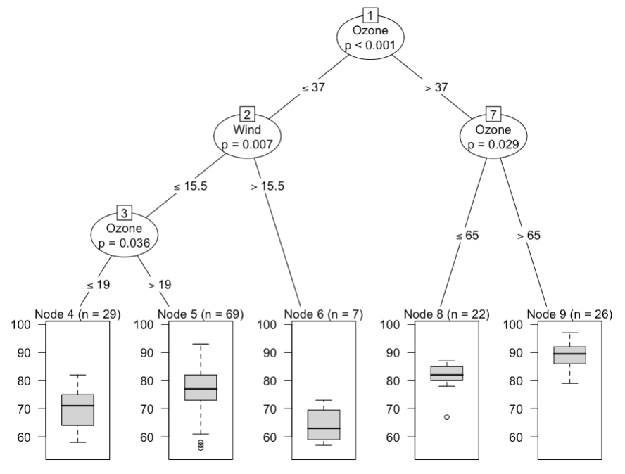
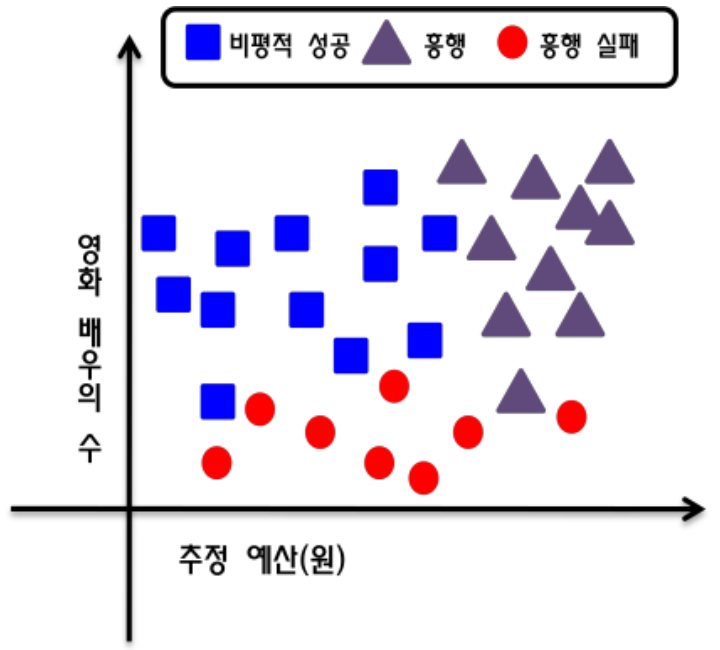
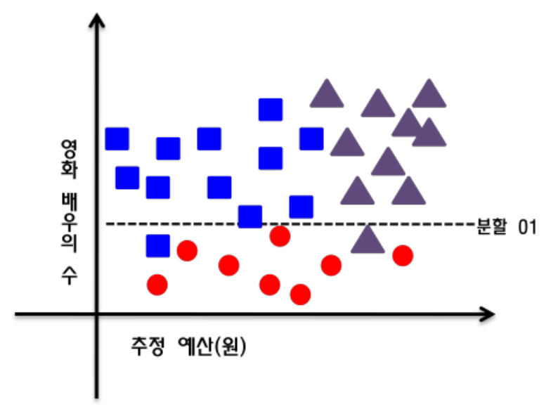
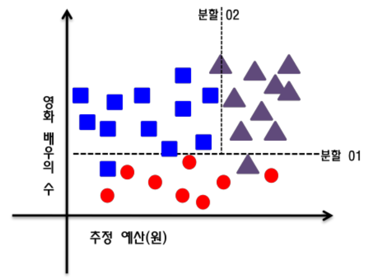
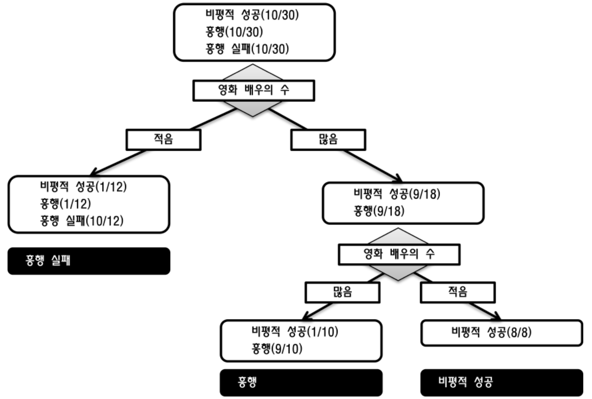

# Overview
의사 결정 트리(Decision Tree)는 **여러 규칙을 순차적으로 적용하여 독립 변수 공간을 지속적으로 분할**해 나가는 분류 모형이다.

***

# 결정 트리

다음 그림은 온도에 가장 많은 영향을 미치는 요소들에 대한 의사 결정 트리이다.



그림에서 보듯이 나무 구조 형태로 분류 결과를 도출해내는 방식이다.

분류 시 독립(입력) 변수 중 가장 영향력 있는 변수를 기준으로 이진 분류하여 Tree 구조 형태로 데이터를 분류하는 방식이다.

결정 노드(node)는 속성에 따라 가지(branches)로 나뉜다.

노드는 데이터 셋에 있는 변수의 이름(컬럼)에 해당하고, 이 변수는 반드시 범주형(nomimal)이어야 한다.

아래로 이어지는 선은 범주형 변수가 가질 수 있는 속성의 종류만큼 분기가 된다. 

제어문의 if~else 형식으로 조건문을 만들게 된다.

Root 노드에서 시작하여 각 속성에 따라 다양한 결정으로 범주를 예측하는 잎 노드까지 내려 간다.

Tree 는 결정들의 조합 결과인 잎 노드(leaf node)로 끝난다.

**분류(classification)**와 **회귀 분석(regression)**에 모두 사용될 수 있기 때문에 CART(Classification And Regression Tree) 라고도 한다.

비교적 모델 생성이 쉽고, 단순하지만 명료한 결과를 제공하기 때문에 현업에서 가장 많이 사용하는 지도 학습 모델이다.

***

# 트리 생성 예시

모든 영화에 대해 3가지 범주로 분류하는 결정 트리 알고리즘을 개발한다고 가정한다.

영화의 예산과 영화 배우 수에 있어 산포도는 다음과 같다.



이 데이터로 단순한 결정 트리를 만들기 위해 '영화 배우의 수' 속성으로 나누면 다음과 같은 그림이 되어, 영화 배우가 많은 영화와 그렇지 않은 영화로 분류가 된다.



다음으로 영화 배우의 수가 많은 부분은 '고예산 영화'와 '저예산 영화'로 다시 분류할 수 있다.



## 각 그룹의 속성

- 왼쪽 위 그룹
  - 비평이 성공적인 영화로, 많은 영화 배우들과 상대적으로 적은 예산
- 오른쪽 위 그룹
  - 많은 예산이 들어갔으며, 많은 영화 배우가 나오는 흥행 영화
- 마지막 그룹
  - 출현한 영화 배우의 수가 적고, 예산과 상관없이 흥행에 실패한 영화

## Diagram

미래에 성공할 영화를 예측하는 모델을 다음과 같이 표현할 수 있다.



***

# 결정 트리 관련 알고리즘

결정 Tree 를 구성하는 알고리즘에는 주로 하향식 기법이 사용되며, 각 진행 단계에서는 주어진 데이터 집합을 가장 적합한 기준으로 분할하는 변수 값이 선택된다.

**지니 불순도, 정보 획득량, 분산 감소** 등이 있다.

***

# Entropy

엔트로피는 열역학에서 말하는 의미와 비슷하게 정보의 무질서도 혹은 복잡도나 불확실성의 정도를 나타낸다.

주어진 데이터 집합에 서로 다른 종류(클래스)들이 많이 섞여 있으면 엔트로피가 높고, 같은 종류(클래스)들이 많이 있으면 엔트로피가 낮은데, 이것을 이용하여 범주 데이터가 얼마나 섞여 있는 지를 나타내는 지표가 된다.

만약, 바구니에 색상이 다른 두 종류의 공이 있다고 가정하자.

이 때, 정보 엔트로피(기대값)는 다음과 같이 구할 수 있다.

> 기대값 = $$\sum p(xi)\times\log2p(xi)$$

만약 바구니에 1색상만 들어있다면 $$\log2(1) = 0$$이므로, 엔트로피는 0이다.

즉, 데이터가 무질서하지 않고 균일하다는 의미이다.

2가지 이상의 공이 서로 섞여 있다면, 2가지 속성으로 완전 분리를 해야 한다.

이 원리가 **의사 결정 트리에서 어떤 변수를 속성 값으로 나누는 판단 기준**이 된다.

의사 결정 트리는 결국 **엔트로피가 높은 상태에서 낮은 상태가 되도록 데이터를 특정 조건을 기준으로 Tree 구조로 구분**하는 알고리즘이다.

***

# party 패키지

party 패키지에서 제공되는 `ctree()` 함수를 이용하면 특정 변수 값을 기준으로 분류 분석된 결과를 의사 결정 트리 형태로 제공하는 함수이다.

반환되는 타입은 Binary Tree 이다.

- 사용 형식
  - `ctree(formula, data)`
- formula
  - 의사 결정 형태로 분석할 포뮬러 지정
  - 포뮬러 사용 예시
    - `formula = 종속변수 ~ 독립변수1 + 독립변수2 + ...`
    - `result = ctree(formula=formula, data=dataset)`
- data
  - 의사 결정 트리를 수행할 데이터 셋

## ctree() 함수 반환 결과 예시

```R
# Conditional inference tree with 5 terminal nodes
# Response: Temp
# Inputs: Solar.R, Wind, Ozone
# Number of observations: 153
# 1) Ozone <= 37; criterion = 1, statistic = 56.086
#     2) Wind <= 15.5; criterion = 0.993, statistic = 9.387
#         3) Ozone <= 19; criterion = 0.964, statistic = 6.299
#             4)* weights = 29
#         3) Ozone > 19
#             5)* weights = 69
#     2) Wind > 15.5
#         6)* weights = 7
# 1) Ozone > 37
#     7) Ozone <= 65; criterion = 0.971, statistic = 6.691
#         8)* weights = 22
#     7) Ozone > 65
#         9)* weights = 26
```

> 7) Ozone <= 65; criterion = 0.971, statistic = 6.691

- 7)
  - 종속 변수(Temp)에 대한 독립 변수(태양광, 바람, 오존 수치)가 영향을 미치는 중요 변수의 척도
  - 수치가 작을 수록 영향을 미치는 정도가 큼
  - 온도에 가장 영향 주는 변수는 오존, 두 번째는 바람
  - 순서는 분기되는 순서
- Ozone <= 65;
  - 의사 결정 트리의 노드 이름
  - `*` 기호는 해당 노드의 마지막 노드(leaf node)
  - `*` 기호가 없으면 임계 값이 조건식으로 옴
- criterion = 0.971,
  - 노드의 분기 기준(criterion)이 되는 수치
  - criterion = 0.971 -> p-value = (1 - 0.971)= 0.029
- statistic = 6.691
  - 종속 변수의 통계량으로써, 수치 값이 크면 영향력이 큼
- 특이 사항
  - 마지막 노드거나 다른 분기가 있는 경우에 3, 4번째 수치는 표시되지 않음
  - 마지막 노드의 weights : 도수 의미

## 분류 분석 결과

`ctree()` 함수의 반환 결과에 `plot()` 함수를 사용하면 분류 분석 결과에 대하여 차트를 다음과 같이 그릴 수 있다.

`plot()` 함수를 간단히 보려면 `type="simple"` 옵션을 사용한다.


- 1)
  -  온도에 가장 영향을 수는 변수는 오존 수치(Ozone)
  -  오존량이 감소하면 대체적으로 온도가 감소
- 2)
  - 두 번째로 영향을 주는 변수는 바람(Wind)
- 3)
  - 오존량이 37 이하, 바람의 양이 15.5 이상이면 평균 온도가 63
- 4)
  - 바람의 양이 15.5 이하인 경우 평균 온도가 70 이상
- 5)
  - 태양광(Solar.R)은 다른 설명 변수에 비해 온도에 크게 영향을 미치지 않는 것으로 분석

***

# rpart 패키지

rpart 패키지에서 제공되는 `rpart()` 함수는 **재귀 분할(recursive partitioning)**이라는 의미를 갖는다.

기존 `ctree()` 함수에 비해서 2수준 요인으로 분산 분석을 실행한 결과를 트리 형태로 제공하여 모형을 단순화해준다. 

Gini Index가 작아지는 방향으로 움직이며, Gini Index를 가장 많이 감소 시키는 변수가 가장 큰 영향을 끼치는 변수가 된다.

- 사용 형식
  - `rpart(formula, data, cp)`
- formula
  - 의사 결정 형태로 분석할 포뮬러를 지정
- data
  - 의사 결정 트리를 수행할 데이터 셋
- cp
  - cp 속성 값을 높이면 가지 수가 적어지고, 낮추면 가지 수가 많아짐(기본 값 : 0.01)