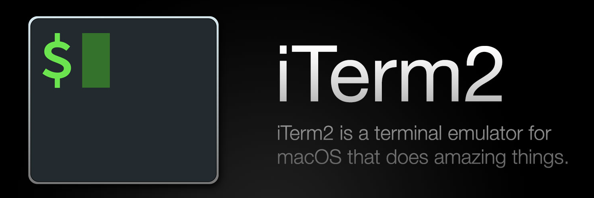
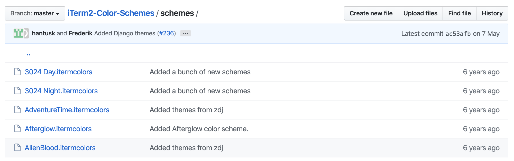
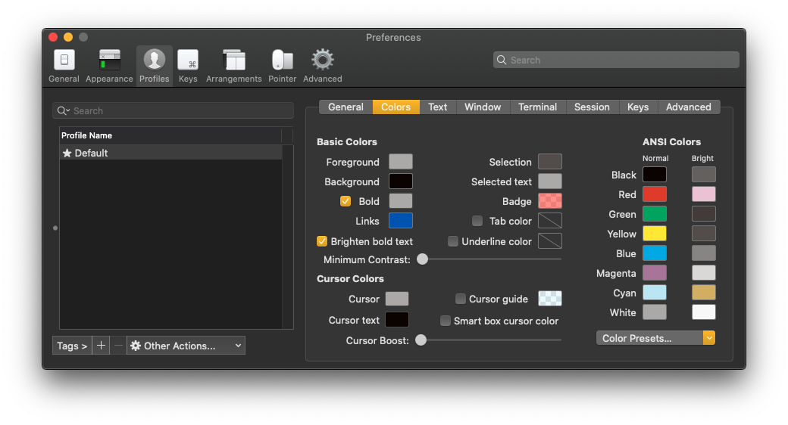
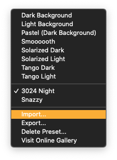

{:height="200"}

## Overview

MacOS Catalina의 기본 Terminal인 ZSH에 Theme과 Plugin을 사용하기 위해 Oh My Zsh를 설치하는 방법을 알아본다.

***

## 사용된 환경

> OS : macOS Catalina 10.15.5(19F101)  
> zsh : zsh 5.7.1 (x86_64-apple-darwin19.0)  
> 기준 일자 : 2020-06-15  

***

## 설치

### iTerm2 설치

{: width="200"}

[iTerm2](https://www.iterm2.com/)는 맥의 기본 터미널 기능을 확장하여 커스텀 단축키나 스크립트, 화면 나누기 등 다양한 기능을 제공한다.

[iTerm2 Color Schemes](https://github.com/mbadolato/iTerm2-Color-Schemes)에 들어가면 iTerm2에서 사용가능한 다양한 Theme을 다운받을 수 있다.



다운받은 폴더의 schemes폴더에 `.itemcolors` 확장자를 가진 파일이 Color Schemes이다.



iTerm2에서 `Preferences - Profile - Colors`의 좌하단에 *Color Presets...*가 Scheme을 변경할 수 있는 옵션이다.



버튼을 클릭하고 *Import...*를 통해 이전에 다운받은 Theme을 선택할 수 있다.

import 받은 Scheme은 다시 *Color Presets...*를 눌러 적용한다.

### Oh My Zsh 설치
ZSH를 더 쉽게 사용할 수 있게 도와주는 플러그인인 *Oh My Zsh*를 설치한다.

```zsh
sh -c "$(curl -fsSL https://raw.github.com/robbyrussell/oh-my-zsh/master/tools/install.sh)"
```

위의 명령어를 터미널에서 실행하여 *Oh My Zsh*를 설치한다.
