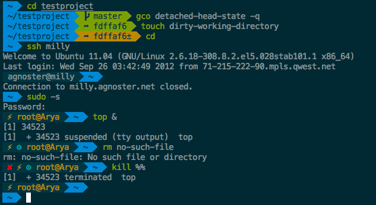

{: width="200" height="200"}

## Overview

MacOS Catalina의 기본 Terminal인 ZSH에 Theme과 Plugin을 사용하기 위해 Oh My Zsh를 설치하는 방법을 알아본다.

***

## 사용된 환경

> OS : macOS Catalina 10.15.5(19F101)  
> zsh : zsh 5.7.1 (x86_64-apple-darwin19.0)  
> 기준 일자 : 2020-06-15  

***

## 설치

### iTerm2 설치

{: width="200"}

[iTerm2](https://www.iterm2.com/)는 맥의 기본 터미널 기능을 확장하여 커스텀 단축키나 스크립트, 화면 나누기 등 다양한 기능을 제공한다.

[iTerm2 Color Schemes](https://github.com/mbadolato/iTerm2-Color-Schemes)에 들어가면 iTerm2에서 사용가능한 다양한 Theme을 다운받을 수 있다.


다운받은 폴더의 schemes폴더에 `.itemcolors` 확장자를 가진 파일이 Color Schemes이다.


iTerm2에서 `Preferences - Profile - Colors`의 좌하단에 *Color Presets...*가 Scheme을 변경할 수 있는 옵션이다.


버튼을 클릭하고 *Import...*를 통해 이전에 다운받은 Theme을 선택할 수 있다.

import 받은 Scheme은 다시 *Color Presets...*를 눌러 적용한다.

### Oh My Zsh 설치
ZSH를 더 쉽게 사용할 수 있게 도와주는 플러그인인 *Oh My Zsh*를 설치한다.

```zsh
sh -c "$(curl -fsSL https://raw.github.com/robbyrussell/oh-my-zsh/master/tools/install.sh)"
```

위의 명령어를 터미널에서 실행하여 *Oh My Zsh*를 설치한다.

### *Agnoster* Theme 설정



*agnoster* Theme는 현재 디렉토리에서 Git의 상태(branch, Commit 여부 등)를 알려준다.

`.zshrc`파일을 수정하여 agnoster Theme으로 설정할 수 있다.

> *Oh My Zsh*를 설치하면 기존에 `.zshrc`파일의 내용은 `.zshrc.pre-oh-my-zsh`파일에 복사가 되니 유의한다.

`.zshrc`파일에서 상단 5 ~ 15번째 줄 사이에 `ZSH_THEME="******"`으로 되어있는 부분을 `ZSH_THEME="agnoster"`로 수정한다.

> **옵션** : 터미널의 이름의 `macbook-pro` 부분을 지우기 위해 `.zshrc`파일 최하단에 다음 코드를 붙여넣는다.

```zsh
prompt_context() {
  if [[ "$USER" != "$DEFAULT_USER" || -n "$SSH_CLIENT" ]]; then
    prompt_segment black default "%(!.%.)$USER"
  fi
}
```

수정된 `.zshrc`파일은 `soruce .zshrc` 명령어로 적용시킨다.

> 만약 폰트가 깨진다면 `D2Coding` 폰트를 iTerm2에 적용한다.

### New Line 적용

명령어를 칠 때 화면에서 벗어나는 경우를 고치기 위해 *New Line* 옵션을 적용해준다.

*agnoster* Theme이 적용된 것을 기준으로 `~/.oh-my-zsh/themes/agnoster.zsh-theme` 파일을 수정한다.

```zsh
build_prompt() {
  RETVAL=$?
  prompt_status
  prompt_virtualenv
  prompt_context
  prompt_dir
  prompt_git
  prompt_bzr
  prompt_hg
  prompt_newline // 이 부분을 추가
  prompt_end
}
```

그리고 하단에 다음 코드를 추가한다.

```zsh
prompt_newline() {
  if [[ -n $CURRENT_BG ]]; then
    echo -n "%{%k%F{$CURRENT_BG}%}$SEGMENT_SEPARATOR
%{%k%F{blue}%}$SEGMENT_SEPARATOR"
  else
    echo -n "%"
  fi

  echo -n "%"
  CURRENT_BG=''
}
```

### *Syntax Highlight* 적용

사용할 수 있는 명령어는 초록색으로 Highlighting 해주고, 잘못된 명령어는 빨간색으로 표시된다.

*Syntax Highlight*는 brew를 통해 설치할 수 있다.

```zsh
brew install zsh-syntax-highlighting
source /usr/local/share/zsh-syntax-highlighting/zsh-syntax-highlighting.zsh
```
